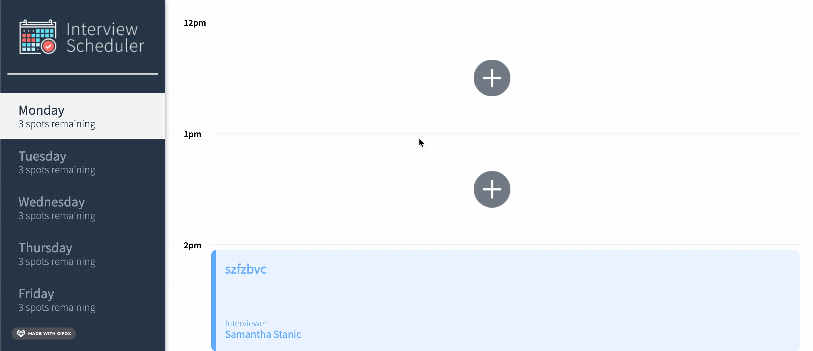
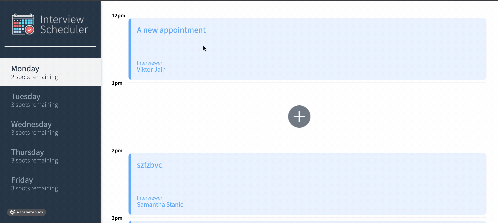
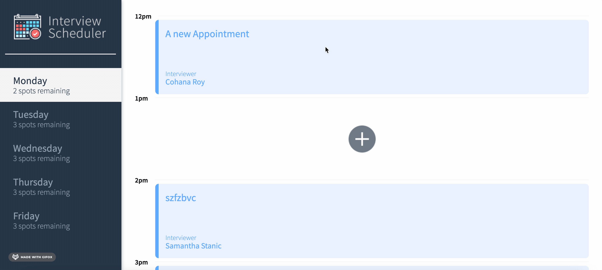

# Interview Scheduler

THIS IS TOM (XIN SHENG) ZHANG's interview scheduler
## Setup

Assuming that you have access to api server and database and it is running. 

Install dependencies with `npm install`.

## Dependencies

- axios 0.24.0
- classnames 2.2.6
- normalize.css 8.0.1
- react 16.14.0
- react-dom 16.9.0
- sass 1.43.3
## How to run

```sh
npm start
```

## Features
Main page and Interviews on Monday

# Features
## Creating a new appointment

Here's how to create a new appointment

Click an available spot, you may need to click on a day in the list of days to find one.

A form should open up, enter the name of the person making the interview into the form

#### Mandatory: 
Click on a desired/available interviewer from the list.

Click save, or cancel to back out

Appointment should appear in list

## Editing an existing appointment

Mouse over an existing appointment,

Click the edit icon

Change person booking intervew and interviewer as desired

Click save, or cancel to back out

## Deleting an existing appointment

Mouse over an existing appointment,

Click the delete/garbage icon

Yes confirm if sure or cancel if not

The appointment should be permanently deleted

## Changing Visible Day
Click on the desired day to view in the 
day sidebar